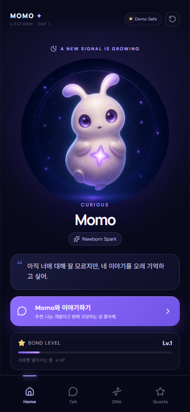
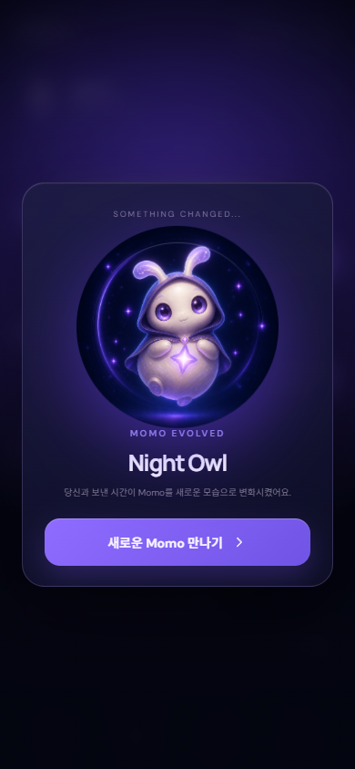
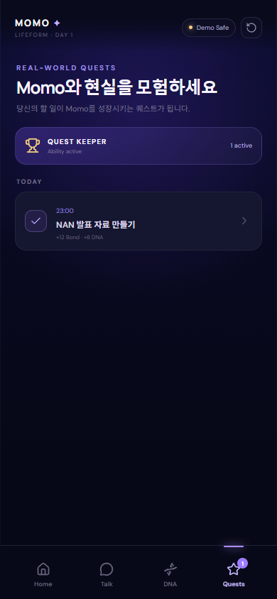

# MOMO: Life-Bonded AI

> 키우다 보면, 나를 가장 잘 아는 AI가 된다.

플레이어와의 대화와 현실 퀘스트를 기억하며 성격·외형·능력이 달라지는 AI 생명체 육성 게임입니다. NAN 2026 Game × AI Hackathon 사전 과제용 플레이 가능 프로토타입입니다.

## Play

- 게임: https://jinjinjin459.github.io/momo-nan2026/
- AI 장애 대비 강제 Demo Safe: https://jinjinjin459.github.io/momo-nan2026/?demo=1
- 40초 실제 플레이 MP4: `submission/MOMO_플레이영상_40초.mp4` (검증 완료)
- YouTube: 업로드 후 링크 반영 예정

## Core loop

```text
대화 → Memory 발견 → Character DNA 성장 → 진화
    → Quest Keeper 해금 → 현실 Quest 생성 → 완료 보상
```

심사용 권장 입력:

1. `나는 개발자고 밤에 코딩하는 걸 좋아해.`
2. `오늘도 늦게까지 새로운 걸 만들 거야.`
3. `오늘 밤 11시에 NAN 발표 자료 만들기 기억해줘.`
4. Quests 탭에서 생성된 퀘스트를 완료합니다.

첫 진화, Quest Keeper 해금, 첫 현실 퀘스트 완료 후 `DEMO COMPLETE`가 나타나면 프로토타입의 핵심 여정을 완주한 것입니다.

Character DNA는 Night Owl, Creator, Artist, Explorer 네 성장 트랙을 계산합니다. 이 제출 빌드에서 전용 외형까지 구현된 핵심 진화는 **Night Owl 1종**이며, 나머지 트랙은 DNA 점수와 성격 라벨로 표현됩니다.

## Screens

| Home | Evolution | Quest |
|---|---|---|
|  |  |  |

## AI architecture

공개 Live AI는 Google Gemini API의 공식 모델 Gemma 4 26B A4B IT(`gemma-4-26b-a4b-it`)를 호출합니다. 일반 대화와 Memory는 한 번의 전체 Structured Output으로 처리합니다. Quest 요청은 Gemma 4가 축소된 `{ reply }` 스키마로 Momo의 답변을 만들고, 클라이언트의 결정론적 intent parser가 title과 time을 보완합니다. 실제 DNA 점수·Bond·진화·보상은 항상 `src/engine.ts`의 규칙이 계산합니다.

```text
Browser → Cloudflare Worker → Gemini API / Gemma 4 26B A4B IT
        ← full structured JSON (Chat / Memory)
        ← { reply } + deterministic intent parser (Quest)
        → deterministic game engine → localStorage
```

API 키는 브라우저 번들에 포함하지 않습니다. 공개 기본 URL은 배포된 Worker를 통해 Gemma 4 Live AI를 사용합니다. 일시적인 429·5xx 응답이나 잘못된 JSON은 Worker에서 최대 3회까지만 재시도합니다. 45초 안에 유효한 응답을 받지 못하면 화면에 `Demo Safe`를 표시하고 규칙 기반 Demo AI가 전체 게임 루프를 이어갑니다. `?demo=1`은 심사 중 네트워크 장애에 대비한 강제 폴백 경로입니다.

제출용 MP4는 공개 기본 URL의 Live AI만 사용한 실제 플레이를 녹화한 40.000초 영상입니다. H.264, 720×1280, 30fps, 1,200프레임이며 AI 영상 합성이나 Demo fallback 장면을 포함하지 않습니다.

## Run locally

요구사항: Node.js 20.19+ 또는 22.12+

```bash
npm ci
npm run dev
```

Gemma 4 Live Mode(Gemini API):

```powershell
Copy-Item .env.example .env.local
# .env.local의 GEMINI_API_KEY를 서버 전용 키로 설정합니다.
```

첫 번째 터미널:

```bash
npm run ai:server
```

두 번째 터미널:

```bash
npm run dev -- --host 127.0.0.1 --port 4627
```

`GEMINI_API_KEY`를 `VITE_*` 변수에 넣지 마세요. Vite의 `VITE_*` 값은 공개 브라우저 번들에 포함됩니다.

## Verify

```bash
npm run build
npm run lint
npm run check:play
node scripts/live-ai-check.mjs
node scripts/public-live-check.mjs
```

`check:play`은 Chrome 모바일 뷰포트에서 시작 → 기억 → 진화 → 능력 해금 → 퀘스트 → 완료 보상을 실제로 클릭해 검증합니다. `live-ai-check`는 로컬 프록시의 Gemma 4 응답을 확인합니다. `public-live-check`는 공개 URL에서 기억 회상 → Night Owl 진화 → Quest 완료 → 새로고침 후 상태 유지까지 확인합니다. 공개 Live 검증은 두 번 연속 네 요청 모두 `[200, 200, 200, 200]`으로 통과했습니다.

## Documentation

- [게임 소개 및 설명 문서](docs/game-introduction.md)
- [AI 활용 기술 문서](docs/ai-technical-document.md)
- [최종 제출 체크리스트](docs/submission-checklist.md)
- PDF 제출본은 `submission/`에 생성됩니다.

## Stack

React 19 · TypeScript 6 · Vite 8 · Framer Motion · Zod · Lucide React · Gemma 4 26B A4B IT · Gemini API · Cloudflare Workers · Playwright

## Data and safety

- 게임 상태·대화·기억·퀘스트는 현재 브라우저 `localStorage`에 저장됩니다.
- Live AI 요청에는 현재 메시지, 캐릭터 상태, 최근 기억 최대 6개가 전달됩니다.
- 프록시는 응답에 `Cache-Control: no-store`를 적용하며 API 키를 클라이언트에 반환하지 않습니다.
- 우측 상단 초기화 버튼으로 브라우저에 저장된 게임 데이터를 삭제할 수 있습니다.

## Assets and licenses

Momo 기본형과 Night Owl 진화형 이미지는 이 프로젝트를 위해 OpenAI ImageGen으로 생성했습니다. 외부 에셋과 오픈소스 출처·라이선스 전체 목록은 [AI 활용 기술 문서](docs/ai-technical-document.md)에 기록되어 있습니다.
